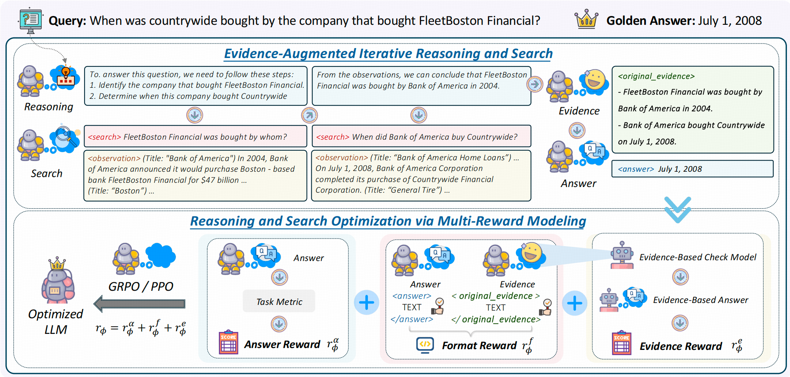

# R-Search: Empowering LLM Reasoning with Search via Multi-Reward Reinforcement Learning

<p align="center">
    🤗 <a href="https://huggingface.co/collections/qingfei1/r-search-6838323c612e76702ed709e6" target="_blank">HF Repo</a> 
</p>

**R-Search** is a novel reinforcement learning framework for reasoning–search integration. It enables LLMs to autonomously perform multi-step reasoning with deep search interaction, and to learn optimal reasoning–search trajectories via multi-reward signals, substantially improving performance on complex logic- and knowledge-intensive tasks.

We release our trained R-Search models and datasets on [Hugging Face](https://huggingface.co/collections/qingfei1/r-search-6838323c612e76702ed709e6).

<div align="center">
    
</div>

---

## ⚙️ Environment Setup

```bash
conda create -n Rsearch python=3.10
conda activate Rsearch
pip install torch==2.4.0
pip install -e .
```

If you wish to use a local retriever, please additionally run:
```bash
conda create -n retrieval python=3.10
conda activate retrieval
conda install -c pytorch -c nvidia faiss-gpu=1.8.0
pip install -r requirements_retri.txt
```

---

## 📦 Data Preparation

You can download our standardized [datasets](https://huggingface.co/datasets/qingfei1/R-Search_datasets) (including corpus, training, and evaluation sets) by running:

```bash
bash scripts/download_data.sh
```

The data will be saved in the `data/` directory.
If you only wish to run training, you only need to download `data/corpus/2wikimultihopqa/train.json`.

For the nq, popqa, triviaqa, and bamboogle corpora, we follow FlashRAG and use the Wiki-2018 Corpus. Due to its large size, please download it separately from [FlashRAG](https://huggingface.co/datasets/RUC-NLPIR/FlashRAG_datasets/tree/main/retrieval-corpus).

---

## 🔍 Retriever Setup

In our experiments, we use a local retriever as the default search engine, employing [e5-base-v2](https://huggingface.co/intfloat/e5-base-v2) as the dense retriever. For training, only the 2wikimultihopqa training set and its retrieval service are required.

To set up the Index and Retrieval service, follow these steps:

First, activate the `retrieval` environment:
```bash
conda activate retrieval
```

### 1. Create Index

For a local dense retriever:
```bash
bash scripts/build_index.sh --corpus 2wikimultihopqa --retriever_name e5
```

For a local sparse retriever (BM25):
```bash
bash scripts/build_index.sh --corpus 2wikimultihopqa --retriever_name bm25
```
You can set `--corpus` to: 2wikimultihopqa, hotpotqa, musique, or wiki-18.

### 2. Launch Local Retrieval Server

- For Dense Retriever:
    ```bash
    bash scripts/retrieval_launch.sh --corpus 2wikimultihopqa --port 8000
    ```
- For Sparse Retriever:
    ```bash
    bash scripts/retrieval_launch_bm25.sh --corpus wiki-18 --port 8001
    ```

Your LLM can access the search engine via the HTTP API, e.g., `http://127.0.0.1:8000/retrieve_2wikimultihopqa`.

To use an online search engine (Google), run:
```bash
bash retrieval_launch_google.sh
```

---

## 🧾 Evidence Evaluation Setup

Evidence evaluation during training uses [Llama-3.2-3B-Instruct](meta-llama/Llama-3.2-3B-Instruct) as the verifier, providing one of the reward signals.

To launch the evidence server, execute:
```bash
conda activate Rsearch
bash scripts/evidence_server.sh
```

---

## 🖥️ R-Search Training

**Before training, please ensure the retrieval and evidence servers are running.**

1. **Build Training Data**
    ```bash
    conda activate Rsearch
    bash scripts/pre_train_data.sh
    ```

2. **Run RL Training (example with Qwen2.5-7B):**
    ```bash
    bash scripts/train_grpo_7b.sh
    bash scripts/train_ppo_7b.sh
    ```

---

## 📊 Evaluation

```bash
cd src/eval
conda activate Rsearch
CUDA_VISIBLE_DEVICES=2 python main.py --method R-Search --model R-Search-3b-grpo --dataset nq
```
- Configure URLs, model checkpoints, and prompts in `src/eval/config.yaml`.
- For nq, popqa, triviaqa, bamboogle: ensure the retrieval server is running on the wiki-18 corpus.
- For 2wikimultihopqa, hotpotqa, and musique: ensure the retrieval server is running on the corresponding corpus.

Evaluation results and output files will be saved in `src/eval/output/`.


---

## 🙏 Acknowledgements

The concept of R-Search is inspired by [Deepseek-R1](https://github.com/deepseek-ai/DeepSeek-R1). Its implementation builds upon [veRL](https://github.com/volcengine/verl) and [Search-R1](https://github.com/PeterGriffinJin/Search-R1).

We sincerely appreciate these teams for their outstanding contributions to open-source research and development.